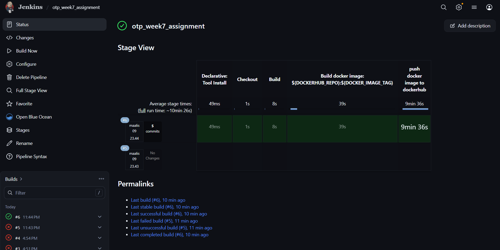
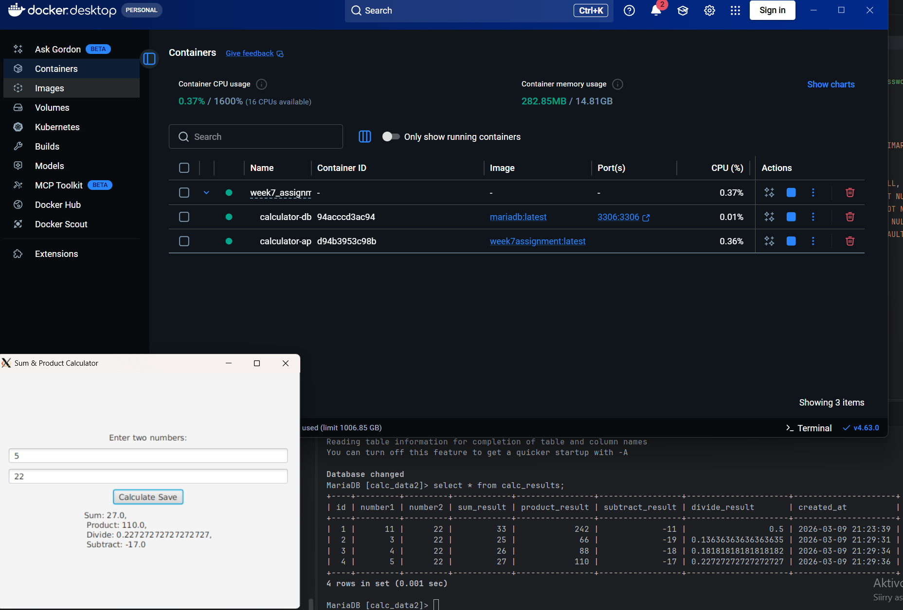

### Submission

1. Take a screenshot of the Jenkins stages performance (only the graphics, not the console output).

<figure>
    
    <figcaption>Screenshot of Jenkins build. Dockerhub was very slow.</figcaption>
</figure>

 

2. Take a screenshot of the Docker image UI performance and the sample database table results.

<figure>
    
    <figcaption>Screenshot of docker container running UI through Xming and database inside another container.</figcaption>
</figure>

 

3. Submit your repository link along with the screenshots (points 1 and 2) on OMA.

This repo and https://hub.docker.com/repository/docker/topiahola/week7_assignment/general